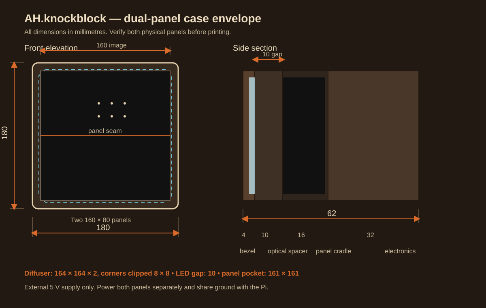

# Dual-panel case

This enclosure holds two Waveshare RGB-Matrix-P2.5-64x32 panels vertically so
they read as one 64×64 display. It is sized for the panel sold under Amazon
ASIN `B0BRBGHFKQ`: each module is nominally 160 × 80 mm and about 14.5 mm
deep.

The design does not use the panels' rear mounting holes because the published
specification does not provide their coordinates. The panels sit in a
perimeter cradle and are held with movable clips instead. Measure both of your
panels before committing to a full print.



## Design summary

| Item | Nominal dimension |
| --- | ---: |
| Finished face | 180 × 180 mm |
| Finished depth | 62 mm |
| Combined panel face | 160 × 160 mm |
| Panel pocket | 161 × 161 × 16 mm |
| Diffuser | 164 × 164 × 2 mm, 8 mm corner clips |
| Diffuser-to-LED gap | 10 mm |
| Front bezel | 4 mm deep |
| Optical spacer | 10 mm deep |
| Panel cradle | 16 mm deep |
| Rear electronics shell | 32 mm deep |

All dimensions are parameters near the top of
[`knockblock_case.scad`](knockblock_case.scad). The 180 mm square parts fit on
a typical 220 × 220 mm printer bed.

### What to measure first

Use calipers and update the matching parameters in the CAD file:

1. Measure the width and height of both panels. Use the larger value plus
   0.6–1.0 mm for `panel_pocket`.
2. Measure from the LED face to the tallest rear component. Include any power
   plug or ribbon-cable bend that must sit inside the cradle.
3. Measure the actual diffuser thickness. Give its pocket 0.3–0.5 mm of total
   clearance.
4. Lay out the Pi, HUB75 adapter, and cables in the 174 × 174 × 29 mm usable
   rear cavity. Increase `electronics_depth` if the cable bend needs it.

The most important test is the pocket fit. Export and print `fit_coupon`
before printing the full case.

## Parts

### Printed parts

- 1 × `bezel`
- 1 × `spacer`
- 1 × `cradle`
- 1 × `back_shell`
- 1 × `diffuser` only when printing the diffuser instead of cutting opal sheet
- 6–8 × `retainer_clip`
- 1 × `fit_coupon` before the production print

PETG or ASA is preferred. Black material prevents light leaking through the
case. PLA can work for a prototype, but the rear cavity contains a Raspberry
Pi and should not be allowed to soften in a warm room.

Suggested starting settings: 0.2 mm layers, four perimeters, five top/bottom
layers, and 25% infill. Print the flat frames face-down. Orient the back shell
with its wall-facing panel on the build plate. The model avoids large internal
supports, although a printer may request small supports at the bottom cable
notch.

### Purchased parts

- 1 × 164 × 164 × 2 mm opal lighting acrylic or polycarbonate diffuser,
  with each corner clipped 8 × 8 mm to clear the face screws
- 4 × M3 × 35 mm black countersunk machine screws for the face
- 4 × M3 heat-set inserts, sized to match the CAD's 4.2 mm insert holes
- 6–8 × M3 × 8 mm screws and matching inserts for the panel clips
- 1–2 mm self-adhesive closed-cell foam for the clips
- 2 × suitable wall screws and anchors
- 4 × 5 mm rubber wall bumpers to preserve airflow behind the rear vents
- Low-voltage cable strain relief or grommet for the 20 × 10 mm bottom entry

The face screws are intentionally visible and serviceable. If a clean face is
more important than tool-free alignment, move the four fasteners to the sides
before printing.

## Diffuser

A 2 mm opal sheet with roughly 30–50% light transmission is a practical
starting point. The 10 mm air gap is four times the 2.5 mm pixel pitch, which
usually blends adjacent pixels while keeping text reasonably sharp. That gap
is a design recommendation, not a manufacturer specification.

For a printed prototype, open
[`stl/knockblock_diffuser.3mf`](stl/knockblock_diffuser.3mf) directly in Bambu
Studio. The plate contains a 164 × 164 × 2 mm diffuser with 8 mm clipped
corners. Use natural or translucent PETG, no supports, and 0.2 mm layers. A
printed panel is useful for fit and light-gap testing, but cut opal acrylic or
polycarbonate will normally produce more even diffusion.

Test the real material before ordering a finished cut:

- Hold a diffuser sample 8, 10, and 12 mm from a lit panel.
- Check white at high brightness for visible hot spots.
- Check small text at normal viewing distance for excessive blur.
- Change `diffuser_gap` in the CAD if another distance looks better.

Do not use a clear sheet described only as "frosted edge." It needs to diffuse
across its face. Smoked LED acrylic improves black levels but often needs a
thin diffusion film behind it to hide individual LEDs.

## CAD export

Open `knockblock_case.scad` in OpenSCAD 2021.01 or newer. Set `part` near the
top of the file, render with F6, then use **File → Export → Export as STL**.

```scad
part = "fit_coupon";     // print this first
part = "bezel";
part = "diffuser";       // optional printable replacement for opal sheet
part = "spacer";
part = "cradle";
part = "back_shell";
part = "retainer_clip";
part = "assembly";      // exploded preview only
```

The `assembly` view is for inspection and is not printable as a single part.

## Assembly

1. Print the fit coupon. Confirm that the panel thickness fits its channel
   without force and the diffuser sample fits its slot.
2. Deburr the diffuser and clean both faces. Lay it in the rear recess of the
   bezel.
3. Join the bezel and optical spacer. Thin black foam tape around the outside
   edge can stop light leaks; keep tape out of the 160 mm image area.
4. Place both panels face-down in the cradle with their long edges touching.
   Keep both arrows/orientation marks pointed the same way. The top panel's
   output ribbon reaches the bottom panel's input.
5. Add foam-faced retaining clips at clear spots around the rear perimeter.
   Tighten only enough to stop movement. Do not bow the PCBs.
6. Join the front stack to the cradle. Check that the physical seam is straight
   before tightening the four face screws.
7. Mount the Pi and adapter in the rear cavity with printed standoffs,
   commercial adhesive standoffs, or cable ties through the ventilation grid.
   Keep metal parts off the PCB underside.
8. Connect HUB75 data and inject 5 V power separately into both panels. Use a
   common ground as described in the main project README.
9. Put a 5 mm rubber bumper near each rear corner. Attach the rear shell to the
   wall with both keyholes, add a third restraint at the bottom if the sign can
   be bumped, then connect the front assembly. Keep the top and bottom vents
   clear.

## Power and heat

Keep the mains-powered AC/DC supply outside this enclosure. Bring only its
low-voltage 5 V output into the bottom cable entry, use strain relief, and
power each panel with its own adequately sized branch. The case provides rear
vents, but they are not a substitute for checking temperature under a
worst-case bright image.

Before leaving the sign unattended, run a full-white screen for 30 minutes at
the intended brightness. Confirm that the printed case, diffuser, wiring, and
Pi remain within their safe operating temperatures.

## Source dimensions

- [Waveshare product page](https://www.waveshare.com/rgb-matrix-p2.5-64x32.htm)
- [Waveshare documentation](https://docs.waveshare.com/RGB-Matrix-Px-64x32)

The source pages specify a 160 × 80 mm panel, 2.5 mm pitch, 64 × 32 pixels,
5 V input, and up to roughly 12 W per module. The enclosure dimensions above
add fabrication clearance and are not an official Waveshare mechanical
drawing.
